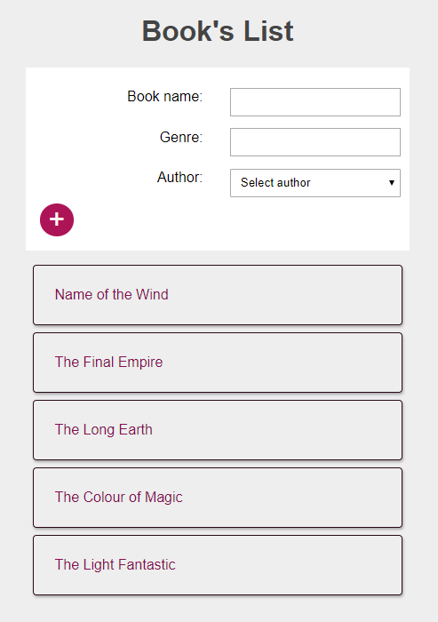
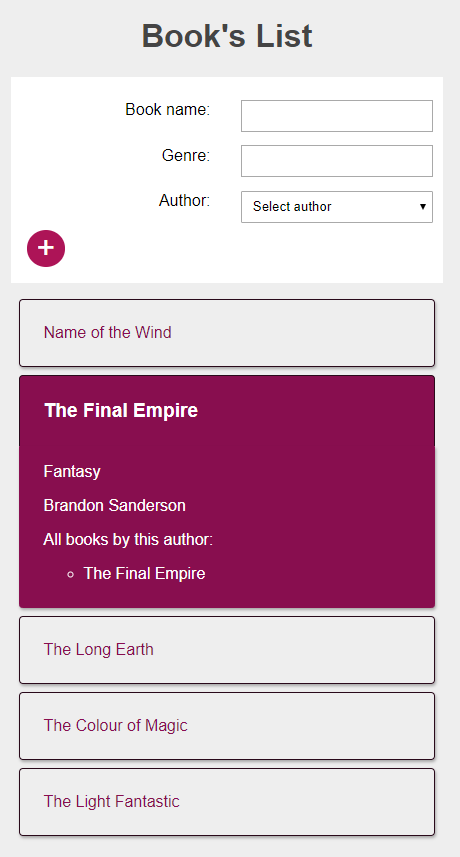
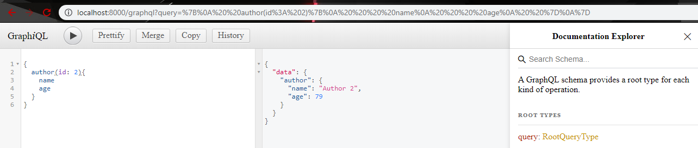

# GraphQL

[A GraphQL Full Course - Novice to Expert from freeCodeCamp](https://www.youtube.com/watch?v=ed8SzALpx1Q)

## App

A list of books where you can add more books and check the book's details.

### Stack

- Frontend: React, apollo
- Backend: Node.js, Express.js, MongoDB
- Tools: Graphiql

### Future features

- move the add books functionality into an Add Books button which will toggle the AddBooksForm component

## Advantages:

- flexibility querying data

- GraphiQL requesting to get author's data
  

- GraphiQL requesting to get nested data
  
