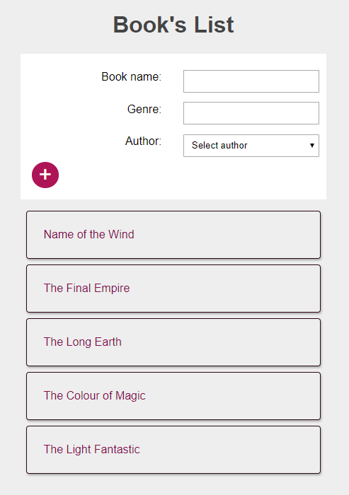
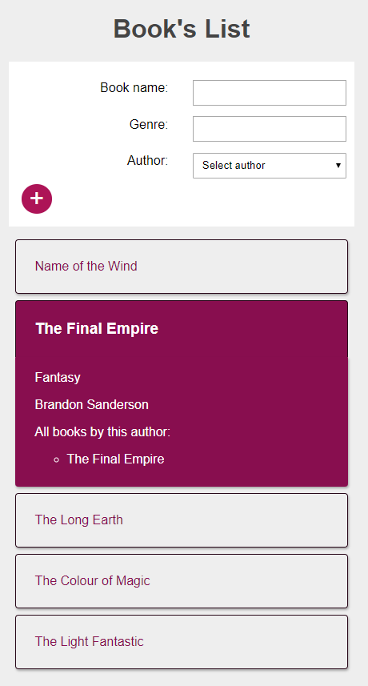
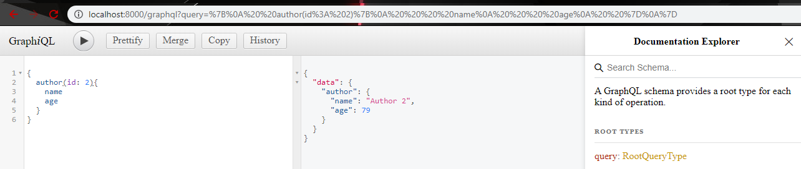
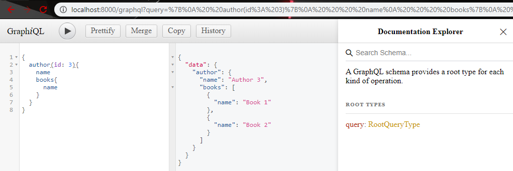

# GraphQL

[A GraphQL Full Course - Novice to Expert from freeCodeCamp](https://www.youtube.com/watch?v=ed8SzALpx1Q)

## App

A list of books where the user can see the book's details and add more books to it.

### Stack

- Frontend: React, apollo
- Backend: Node.js, Express.js, MongoDB
- Tools: GraphiQL

### Future features

- move the add books functionality into an Add Books button which will toggle the AddBooksForm component

### Known issues

- needs to convert dateOfBirth

## Advantages:

- flexibility querying data

## Requests:

- GraphiQL requesting to get author's data
  

- GraphiQL requesting to get nested data
  

## How to run the App

- Server: run `npm start`
- Client: run `npm start`
  Development: change `"start": "node server.js",` to `"start": "react-scripts start",`
